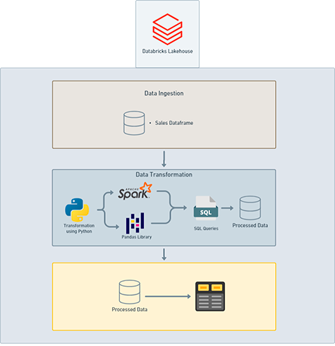

# 🏥 Databricks Optical Campaign for Hoya Products

[](https://databricks.com/)
[](https://spark.apache.org/docs/latest/api/python/)
[](https://en.wikipedia.org/wiki/SQL)
[](https://pandas.pydata.org/)

## 📄 **Project Overview**

This project focuses on leveraging **Databricks** to identify and engage customers who purchased **Hoya** products from **Ótica Holy Glasses** before 2024. The goal is to re-establish contact with these customers for potential new purchases or product upgrades.

---

## 🎯 **Objectives**

- **Customer Identification:** Extract a list of customers who have previously purchased Hoya products.
- **Data Transformation:** Process and transform the data to prepare for targeted marketing campaigns.
- **Campaign Execution:** Utilize the transformed data to reach out to customers for potential re-engagement.

---

## 🛠 **Technologies Utilized**

- **Databricks:** Unified analytics platform for data engineering and machine learning.
- **PySpark:** Python API for Apache Spark, used for large-scale data processing.
- **SQL:** Structured Query Language for querying and managing relational databases.
- **Pandas:** Python library for data manipulation and analysis.

---

## 📈 **Workflow Diagram**



---

## 📂 **Repository Structure**

```bash
📦 Databricks-SQL-Optical-Campaign
 ┣ 📜 Hoya_Campaign_SBC.ipynb   # Jupyter Notebook with analysis and code
 ┣ 📜 Hoya_Campaign_SBC.sql     # SQL script for data analisys and transformation
 ┣ 📜 workflow.png              # Visual representation of the data workflow
 ┗ 📜 README.md                 # Project documentation
```

---

## 🚀 **Getting Started**

1. **Clone the Repository:**
   ```bash
   git clone https://github.com/RenanBjj/Databricks-SQL-Optical-Campaign.git
   cd Databricks-SQL-Optical-Campaign
   ```

2. **Set Up Your Environment:**
   - Ensure you have access to **Databricks** and an appropriate **workspace**.
   - Install the necessary dependencies:
     ```bash
     pip install pyspark pandas
     ```

3. **Run the SQL Script:**
   - Open the `Hoya_Campaign_SBC.sql` file and execute it within your SQL environment or Databricks.

4. **Analyze the Data:**
   - Open `Hoya_Campaign_SBC.ipynb` in **Jupyter Notebook** or Databricks and follow the analysis process.

---

## 📬 **Contact**

For questions or collaborations:

- **GitHub:** [RenanBjj](https://github.com/RenanBjj)
- **LinkedIn:** [Renan Marques Rodrigues](https://www.linkedin.com/in/renan-marques-rodrigues/)
- **Email:** [renan.marques@example.com](mailto:renanbjj88@gmail.com)

---

🚀 Developed with passion for data engineering and analytics!
